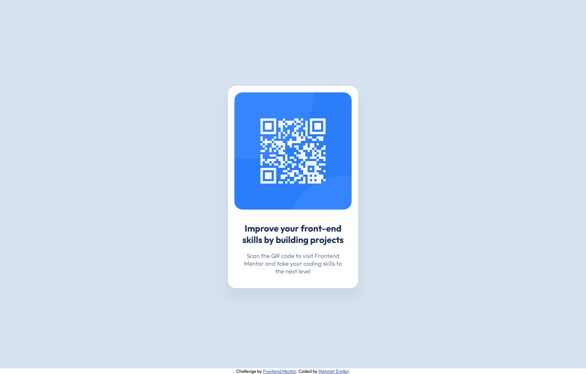

# Frontend Mentor - QR code component solution

This is a solution to the [QR code component challenge on Frontend Mentor](https://www.frontendmentor.io/challenges/qr-code-component-iux_sIO_H). Frontend Mentor challenges help you improve your coding skills by building realistic projects.

## Table of contents

- [Overview](#overview)
  - [Screenshot](#screenshot)
  - [Links](#links)
- [My process](#my-process)
  - [Built with](#built-with)
  - [Useful resources](#useful-resources)
- [Author](#author)

## Overview

### Screenshots

### Links

- Solution URL: [Github repo](https://github.com/mehmeterogul/qr-code-component)
- Live Site URL: [Github Pages](https://mehmeterogul.github.io/qr-code-component/)

## My process

### Built with

- CSS custom properties
- Flexbox
- Media queries

### Useful resources

- [CSS Box Shadow](https://www.w3schools.com/css/css3_shadows_box.asp) - This helped me while using box-shadow property.
- [CSS Variables](https://www.w3schools.com/css/css3_variables.asp) - This helped me while using css variables.

## Author

- Github - [@mehmeterogul](https://www.github.com/mehmeterogul)
- Frontend Mentor - [@mehmeterogul](https://www.frontendmentor.io/profile/mehmeterogul)
- Twitter - [@MehmetErogul96](https://www.twitter.com/MehmetErogul96)
